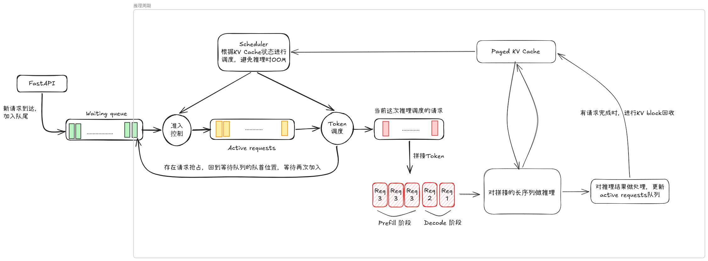
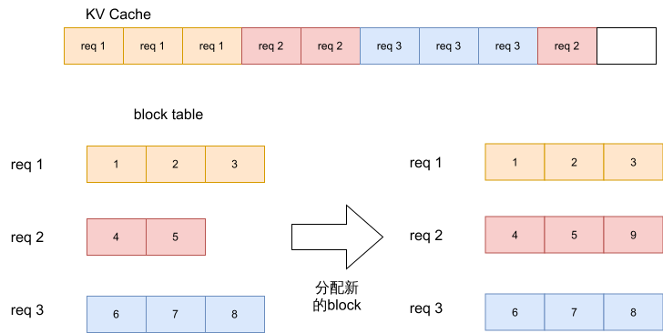
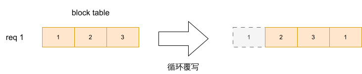
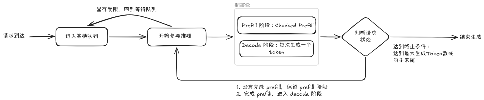

# mini-vLLM

一个从零实现的轻量级 LLM 推理引擎，复现了 vLLM 的核心机制，包括 Paged KV Cache、Continuous Batching、Chunked Prefill 以及抢占式调度。以 Mistral-7B 为后端模型，通过 FlashInfer 加速 Attention 计算。

## 整体架构




## 1. KV Cache 管理

采用 **Paged KV Cache** 设计，将显存划分为固定大小的 Block（默认 `block_size=16`），即每个 Block 最多可以存储16个来自统一请求的 Token 对应的 KV Cache。

- 全局 Cache 张量形状：`[num_layers, num_blocks, 2, block_size, num_kv_heads, head_dim]`
- 每个请求维护一张 `block_table`，记录该请求占用的 Block 索引列表
- 支持 **Block 预占（reserve）** 机制：在请求被调度前提前预留显存，避免推理中途 OOM

### 1.1 KV Cache 结构示意图



### 1.2 滑动窗口下的KV Cache

滑动窗口机制可以确保每个请求占用的 KV Cache block 存在上界，利用这一点可以让显存不会无休止上涨。当某个请求在decode阶段的需要的block数量超过这一上界时，我们采用循环的方式复用旧显存块：



## 2. 支持 Continous Batching 的推理内核

用 **monkey patch** 的方式替换 HuggingFace Mistral 模型每一层的 `self_attn.forward`，将标准的 `nn.MultiheadAttention` 替换为基于 FlashInfer 的 Paged Attention：

1. 计算 QKV 并施加 RoPE
2. 调用 `flashinfer.append_paged_kv_cache` 将新 KV 写入全局 Block Pool
3. 调用 `flashinfer.BatchPrefillWithPagedKVCacheWrapper.run` 完成 Attention 计算

## 3. 调度器（`scheduler`）

异步 `while True` 循环，每轮执行以下步骤：

### Step 1 — 准入控制（Admission Control）
从 `waiting_queue` 中取出请求，只要剩余 Block 数量足以覆盖该请求的 Prefill 长度，就将其移入 `active_requests` 并预占对应 Block。

### Step 2 — 调度决策
在 `token_budget`（默认 128 tokens/step）的约束下：

- **Decode 请求优先**：确保已经在生成阶段的请求每轮都能获得 1 个 token 的预算
- **Chunked Prefill**：Prefill 请求按 `CHUNK_SIZE`（默认 16）分块送入，避免单个长请求独占算力，同时也控制 KV Block 分配的粒度
- **抢占（Preemption）**：若 Decode 请求无法获得新 Block，调度器会选择"代价最小"的受害者（优先抢占 Prefill 请求，其次 Decode 请求）释放其 Block，保证高优先级请求继续执行


### Request 生命周期示意

在上面的调度逻辑下，每个请求的从到达到完成可能历经如下几个阶段：



## 4. 推理

将来自不同请求的 Token 拼接成一个长序列，通过控制不同请求之间的可见性来实现连续批处理。底层 Kernel 直接采用了 `FlashInfer` 的 `BatchPrefillWithPagedKVCacheWrapper`， 在每轮推理前通过 `prepare_metadata` 构建 `FlashInfer` 所需的索引张量：

| 字段 | 含义 |
|---|---|
| `paged_kv_indices` | 本 batch 所有请求占用的 Block 全局索引 |
| `paged_kv_indptr` | 每个请求在 `paged_kv_indices` 中的起止偏移 |
| `paged_kv_last_page_len` | 每个请求最后一个 Block 的实际有效长度 |
| `qo_indptr` | 每个请求的 Query token 在拼接序列中的起止偏移 |
| `batch_indices` / `positions` | 每个 token 对应的请求编号及位置编码索引 |


## 性能评估

**实验设置：**
- 模型：Mistral-7B
- 硬件：单卡 4090 GPU
- 并发数：16
- 请求数量：100 个长短不一致的请求


主要对比了自己实现的 vllm 和 hugging face 直接按 batch 处理的性能差异。

Hugging Face 的测试结果 (BS = Batch Size) 如下，当 `Batch_Size` 增到到 16 之后，系统性能不再有明显提示，可以认为这个就是最佳性能。

| 参数设置 | QPS (req/s) |  Avg Latency (P50/P95/P99) | Throughput (Token/s) | TTFT (P50/P95/P99) | TPOT (P50/P95/P99) |
|---|---|---|---|---|---|
| BS = 4  | 0.37 | 42.57 / 45.66 / 47.87 s | 146.48 | 42.566 / 45.661 / 47.861 s | -/-/- |
| BS = 8  | 0.66 | 23.66 / 23.73 / 23.75 s | 259.13 | 23.661 / 23.723 / 23.750 s | -/-/- |
| BS = 16 | 1.06 | 13.88 / 14.20 / 14.23 s | 417.76 | 13.881 / 14.195 / 14.226 s | -/-/- |
| BS = 32 | 1.06 | 13.88 / 14.77 / 14.81 s | 415.40 | 13.880 / 14.770 / 14.801 s | -/-/- |
| BS = 64 | 1.07 | 13.85 / 14.17 / 14.20 s | 418.73 | 13.847 / 14.164 / 14.197 s | -/-/- |


当我预留 512 个KV Cache Block 时，不同参数下我的 vllm (`sw_vllm.py`) 的性能表现 (`MAX_TOKENS_PER_STEP`, `CHUNK_SIZE`) 如下：

| 参数设置 (Token budget, Chunk size) | QPS (req/s) |  Avg Latency (P50/P95/P99) | Throughput (Token/s) | TTFT (P50/P95/P99) | TPOT (P50/P95/P99) |
|---|---|---|---|---|---|
| 1024, 32 | 1.89 | 7.94 / 11.83 / 12.32 s | 594.84 | 0.050 / 0.414 / 0.415 s | 0.0242 / 0.0242 / 0.0242 s/token | 
| 512, 32 | 1.97 |  7.42 / 11.09 / 11.89 s | 627.44 | 0.046 / 0.407 / 0.407 s | 0.0226 / 0.0226 / 0.0227 s/token |
| 256, 32 | 1.94 |  7.44 / 11.09 / 11.88 s | 631.56 | 0.046 / 0.399 / 0.400 s | 0.0226 / 0.0226 / 0.0227 s/token |
| 128, 32 | 1.84 |  7.45 / 11.24 / 11.90 s | 620.32 | 0.046 / 0.390 / 0.416 s | 0.0226 / 0.0227 / 0.0227 s/token |
| 64, 32 (✅)  | 2.01 |  7.44 / 11.05 / 11.90 s | 654.57 | 0.046 / 0.393 / 0.442 s | 0.0226 / 0.0227 / 0.0227 s/token |
| 64, 16  | 2.02 |  7.44 / 11.12 / 11.86 s | 639.99 | 0.046 / 0.379 / 0.427 s | 0.0226 / 0.0226 / 0.0226 s/token |
| 64, 8   | 1.96 |  7.47 / 11.16 / 11.92 s | 633.16 | 0.070 / 0.408 / 0.409 s | 0.0227 / 0.0227 / 0.0227 s/token |
| 32, 32  | 1.85 |  7.83 / 11.16 / 11.95 s | 621.46 | 0.047 / 0.508 / 0.622 s | 0.0227 / 0.0227 / 0.0228 s/token |

**结论：** 

首先，与 Hugging Face 的静态 batch baseline 相比，所实现的 vLLM-like 系统在所有配置下均实现了显著的性能提升，具体表现为：
- QPS 提升约 1.7×–2.0×
- 吞吐提升约 1.5×
- TTFT 降低两个数量级（从 ~13s 降至 ~0.04–0.07s）
- TPOT 稳定在 ~0.022–0.023 s/token

实验结果表明 `MAX_TOKENS_PER_STEP` 对系统性能存在明显的 非单调影响：
- 当 `MAX_TOKENS_PER_STEP` 较小时，GPU 的利用率不足，没有跑满GPU
- 当 `MAX_TOKENS_PER_STEP` 增大到一定程度时，猜想是单次计算的非平衡性（比如部分请求的 token 数量远多于其他请求）拖慢了系统，进而减小整体的吞吐率。


我同样测试了减少预留的 KV Cache Block 数量对性能的影响，当预留的 Block 数量减少到一定程度时，抢占的频率会增加，同时新请求也更难开始参与推理，系统性能会明显下降：

| 参数设置 (KV Block, Token budget, Chunk size) | QPS (req/s) |  Avg Latency (P50/P95/P99) | Throughput (Token/s) | TTFT (P50/P95/P99) | TPOT (P50/P95/P99) |
|---|---|---|---|---|---|
| 512, 64, 32 |  2.01 |  7.44 / 11.05 / 11.90 s | 654.57 | 0.046 / 0.393 / 0.442 s | 0.0226 / 0.0227 / 0.0227 s/token | 
| 256, 64, 32 | 1.77 | 7.94 / 11.72 / 14.34 s | 522.41 | 0.048 / 0.379 / 0.622 s | 0.0229 / 0.0235 / 0.0294 s/token | 
| 128, 64, 32 | 1.19 | 10.62 / 22.50 / 49.34 s | 224.97 | 2.129 / 7.619 / 9.614 s | 0.0224 / 0.0471 / 0.0906 s/token | 


## 测试代码

```bash
# 安装依赖
uv sync

# 启动服务（需要修改 model_path 为本地路径）
uv run python mini_vllm/sw_vllm.py

# 测试输出
uv run python test_client.py

# 统计性能
uv run python benchmark.py
```

## 改进空间

目前的推理系统可以从一下角度进一步提高效率：
1. `prefix cache` 机制：对于同一请求的连续 decode 步骤，前一次 decode 生成的 KV Cache 可以直接复用，无需每轮都从全局 Block Pool 重新加载
2. 更合理的调度策略： 每次推理应尽可能保证不被某一个请求拖后腿，可以考虑根据请求已经生成的长度（影响 KV Cache 大小）等同一批请求进行优化
3. 更细粒度的抢占策略：目前的抢占机制较为粗暴，可以考虑引入更细粒度的优先级评估，例如根据请求的剩余长度、历史响应时间等因素动态调整优先级
